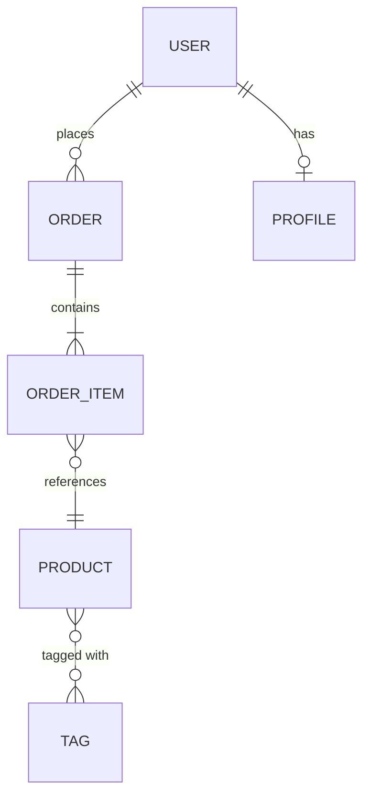

# Skill: Data Modeling

## Cuándo aplicar
- Al diseñar la base de datos de un módulo nuevo.
- Al añadir entidades o relaciones a un esquema existente.
- Cuando el usuario describe requisitos funcionales y necesita traducirlos a modelo de datos.

## Proceso

### 1. Extraer entidades de los requisitos
Leer los requisitos funcionales e identificar:
- **Sustantivos** = candidatos a entidad (User, Order, Product, Invoice).
- **Verbos** = candidatos a relación (compra, asigna, pertenece a).
- **Adjetivos/estados** = candidatos a enum o tabla de lookup (activo, pendiente, cancelado).

### 2. Definir relaciones

| Tipo | Notación | Ejemplo | Implementación |
|------|----------|---------|----------------|
| **1:1** | User ── Profile | Un usuario tiene un perfil | FK en la tabla dependiente o misma tabla |
| **1:N** | User ──< Orders | Un usuario tiene muchas órdenes | FK `user_id` en `orders` |
| **N:M** | Product >──< Tag | Un producto tiene muchos tags y viceversa | Tabla pivote `product_tag` |
| **Polimórfica** | Comment → (Post\|Video) | Un comentario pertenece a post o video | `commentable_id` + `commentable_type` |
| **Self-referencial** | Category ──< Category | Categorías con subcategorías | `parent_id` en la misma tabla |

### 3. Definir campos por entidad

Para cada entidad, definir:

| Campo | Tipo | Nullable | Default | Índice | Notas |
|-------|------|----------|---------|--------|-------|
| id | BIGINT UNSIGNED | No | auto | PK | — |
| name | VARCHAR(255) | No | — | — | — |
| email | VARCHAR(255) | No | — | UNIQUE | — |
| status | ENUM | No | 'draft' | INDEX | draft, active, inactive |
| user_id | BIGINT UNSIGNED | No | — | FK + INDEX | ON DELETE CASCADE |
| created_at | TIMESTAMP | No | CURRENT | — | — |
| updated_at | TIMESTAMP | No | CURRENT | — | — |

**Tipos recomendados:**
| Dato | Tipo SQL | Tipo Laravel |
|------|---------|-------------|
| ID | `BIGINT UNSIGNED` | `id()` |
| Nombre/texto corto | `VARCHAR(255)` | `string()` |
| Texto largo | `TEXT` | `text()` |
| Email | `VARCHAR(255)` | `string()->unique()` |
| Dinero | `DECIMAL(10,2)` | `decimal('amount', 10, 2)` |
| Booleano | `TINYINT(1)` | `boolean()->default(false)` |
| Fecha | `DATE` | `date()` |
| Fecha+hora | `TIMESTAMP` | `timestamp()` |
| JSON | `JSON` | `json()` |
| Enum | `ENUM` o `VARCHAR` | `enum()` o string + cast PHP |
| UUID | `CHAR(36)` | `uuid()` |
| Archivo/path | `VARCHAR(500)` | `string('path', 500)` |

### 4. Normalización

**3NF como punto de partida:**
1. **1NF**: No arrays en campos. Cada campo es atómico.
2. **2NF**: Todo campo no-key depende de la PK completa.
3. **3NF**: Ningún campo no-key depende de otro campo no-key.

**Cuándo desnormalizar:**
- Queries de lectura frecuentes y costosas (contadores, totales).
- Datos históricos que no deben cambiar (snapshot de precio al momento de compra).
- Performance con evidencia medida, no suposición.

### 5. Diagrama ER

Producir diagrama Mermaid:


### 6. Validar el modelo

Checklist antes de implementar:
- [ ] ¿Cada entidad tiene PK (id)?
- [ ] ¿Las FK tienen índice?
- [ ] ¿Los campos de búsqueda frecuente tienen índice?
- [ ] ¿Los UNIQUE constraints están donde se necesitan?
- [ ] ¿ON DELETE está definido en todas las FK? (CASCADE, SET NULL, RESTRICT).
- [ ] ¿Los timestamps (created_at, updated_at) están en todas las tablas?
- [ ] ¿Soft delete (`deleted_at`) donde aplique?
- [ ] ¿Los ENUMs están definidos como cast PHP, no solo en DB?
- [ ] ¿El modelo soporta los queries principales sin JOINs costosos?
- [ ] ¿Se consideró el volumen a 1 año? ¿Hay plan de partición/archivado si aplica?

## Formato de respuesta

```markdown
### Entidades
{Tabla con campos, tipos, constraints}

### Relaciones
{Tabla o lista con tipo de relación}

### Diagrama ER
{Mermaid}

### Migraciones
{Código de migraciones Laravel o SQL}

### Modelos Eloquent
{Código con relaciones, casts, fillable}
```

## Errores comunes
- ❌ Guardar datos derivados que se pueden calcular (total = sum de items).
- ❌ Usar VARCHAR para todo (usar tipos específicos: DECIMAL para dinero, TIMESTAMP para fechas).
- ❌ Olvidar ON DELETE en FK (default es RESTRICT, que puede bloquear borrados).
- ❌ Tablas pivote sin timestamps (útiles para saber cuándo se creó la relación).
- ❌ No considerar soft delete en entidades con historial importante.

